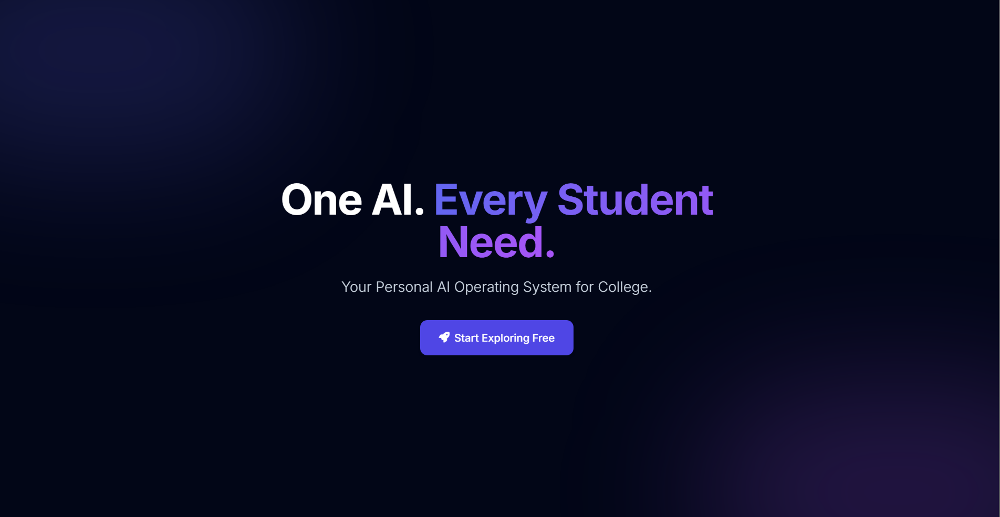
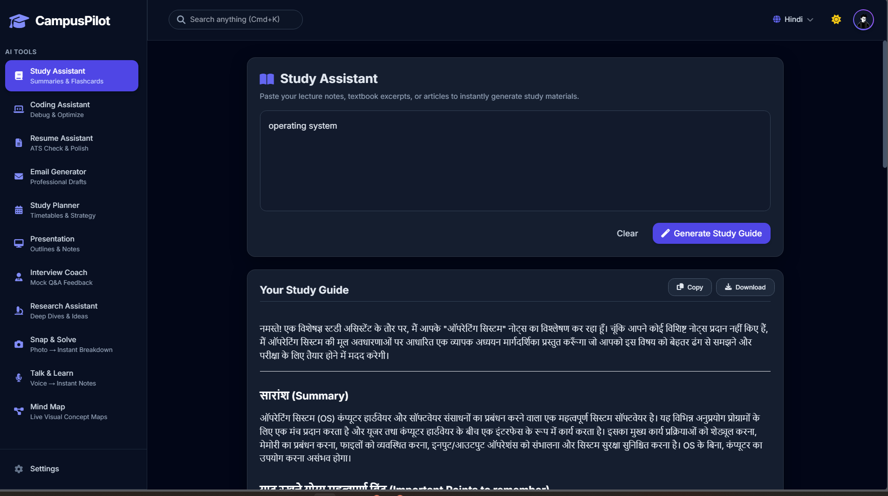

# 🚀 CampusPilot AI
### *Vibe Coding Project built with Gemini Canvas as a part of **Represent India at Google's Edu on Air 2026*** 🇮🇳✨

<p align="center">


</p>

---

# 🌟 About the Project

**CampusPilot AI** is an AI-powered productivity platform built entirely through **Vibe Coding using Gemini Canvas**.

The goal of the project is to create an **AI Operating System for Students**, helping them learn, code, prepare for placements, communicate professionally, research efficiently, and boost productivity—all from one modern interface.

This project was developed as a part of **Represent India at Google's Edu on Air 2026**.

---

# 🎯 Vision

> **One AI. Every Student Need.**

CampusPilot AI combines multiple AI-powered academic and career tools into a single beautiful workspace powered by **Google Gemini**.

---

# ✨ Features

## 📚 Study Assistant
- Generate smart study guides
- AI summaries
- Flashcards
- Key points
- Memory tricks
- Exam preparation

---

## 💻 Coding Assistant
- Explain code
- Debug errors
- Optimize code
- Time & Space Complexity
- Best practices
- Beginner-friendly explanations

---

## 📄 Resume Assistant
- ATS Resume Analysis
- Resume Improvements
- Keyword Suggestions
- Professional Resume Review

---

## 📧 Email Generator
Generate professional emails instantly.

Supports:
- Internship Applications
- Leave Requests
- Follow-ups
- Invitations
- Professional Communication

---

## 📅 Study Planner
Create intelligent study schedules based on:
- Subjects
- Daily study hours
- Deadlines
- Exam dates

---

## 🖥 Presentation Generator
Generate:
- Presentation outlines
- Speaker notes
- Slide structure
- Opening & Closing speeches
- Audience questions

---

## 🎤 Interview Coach
- Mock Interview
- AI Feedback
- Confidence Score
- Strength Analysis
- Weakness Detection
- Improved Answers

---

## 🔬 Research Assistant
Generate research reports with:
- Topic Overview
- Key Concepts
- Future Scope
- References
- Latest Trends

---

## 📷 Snap & Solve
Upload an image and instantly:
- Analyze
- Explain
- Solve problems
- Extract important information

---

## 🎙 Talk & Learn
Voice-powered AI learning.

- Speak naturally
- Get AI responses
- Learn interactively

---

## 🧠 Mind Map
Generate beautiful AI-powered concept maps from any topic.

Perfect for:
- Revision
- Brainstorming
- Visual Learning

---

## 🌐 Multi-Language Support

Supports multiple languages including:

- 🇬🇧 English
- 🇮🇳 Hindi
- 🇮🇳 Punjabi
- 🇮🇳 Gujarati
- 🇮🇳 Bengali
- 🇮🇳 Tamil
- 🇮🇳 Telugu
- 🇮🇳 Kannada
- 🇮🇳 Malayalam
- 🇮🇳 Marathi

---

# 🖼 User Interface

✔ Modern Dashboard

✔ Dark Mode

✔ Responsive Layout

✔ Beautiful Sidebar Navigation

✔ Glassmorphism UI

✔ Animated Components

✔ Quick Search

✔ Copy Responses

✔ Download Responses

---

# 🛠 Tech Stack

| Technology | Usage |
|------------|-------|
| React.js | Frontend |
| Vite | Build Tool |
| Tailwind CSS | Styling |
| JavaScript | Programming Language |
| Google Gemini API | AI Engine |
| HTML5 | Structure |
| CSS3 | Styling |
| Local Storage | Preferences & Settings |

---

# 📂 Project Structure

```
campus-pilot-ai
│
├── public
├── src
│   ├── assets
│   ├── components
│   ├── context
│   ├── lib
│   ├── pages
│   ├── tools
│   ├── App.jsx
│   ├── main.jsx
│   └── index.css
│
├── package.json
├── vite.config.js
├── tailwind.config.js
└── README.md
```

---

# 🚀 Getting Started

## Clone Repository

```bash
git clone https://github.com/yourusername/CampusPilot-AI.git
```

---

## Navigate

```bash
cd CampusPilot-AI
```

---

## Install Dependencies

```bash
npm install
```

---

## Configure Environment Variables

Create a `.env` file in the project root:

```env
VITE_GEMINI_API_KEY=YOUR_GEMINI_API_KEY
```

---

## Run

```bash
npm run dev
```

---

Open

```
http://localhost:5173
```

---

# 📸 Screenshots

<table>
<tr>
<td>



</td>
<td>



</td>
</tr>
</table>

---

# 💡 Future Enhancements

- AI Workspace
- Intent Detection
- AI Memory
- Smart History
- Voice Commands
- PDF Upload
- DOCX Support
- AI Chat Continuation
- Export to PDF
- AI Workflow Automation
- Calendar Integration
- Cloud Sync

---

# 🎯 Why CampusPilot AI?

CampusPilot AI is designed to become the **AI companion for every student**.

Instead of using multiple websites and tools, students can:

- Learn
- Code
- Build Resume
- Prepare Interviews
- Conduct Research
- Generate Presentations
- Manage Study Plans
- Solve Questions
- Learn via Voice

—all inside a single intelligent platform.

---

# 🙌 Acknowledgements

Special thanks to

- 💙 Google
- 💙 Google Gemini
- 💙 Gemini Canvas
- 💙 React
- 💙 Tailwind CSS
- 💙 Vite

for enabling rapid AI-powered application development.

---

# 👨‍💻 Developer

**Saksham Dhiman**

B.Tech Computer Science Engineering

Built with ❤️ using **Gemini Canvas + Google Gemini**

---

<p align="center">

## ⭐ If you like this project, consider giving it a Star ⭐

### 🚀 Built with Vibe Coding • Powered by Google Gemini • Represent India at Google's Edu on Air 2026 🇮🇳

</p>